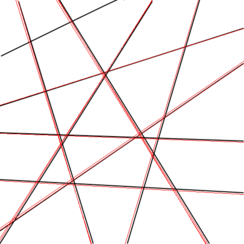
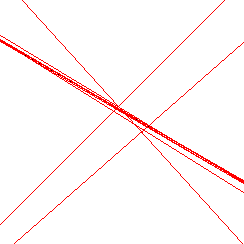

# Random Radon Transformation

This is implementation of fast, but not very accurate Random Radon Transformation, which is presented in [the following article](https://backend.orbit.dtu.dk/ws/portalfiles/portal/5529668/Binder1.pdf). 

Usage
------------

Radon Radon Transformation usage looks like:
```
   $ poetry run random-radon-transformation [OPTIONS]
```
Where `[OPTIONS]` are `source` and `output` -- path to the source image for the transformation, pay attention that it should be a file, and path where output will be written, pay attention that it should be a directory.

Mind the right order.

Testing
------------
To run tests use:

```
   $ nox -r
```

## Examples

### simple line


### many lines



### light noise



We see that algorithm successfully cope with different number of lines, however can't deal with noise due to it's random nature.
